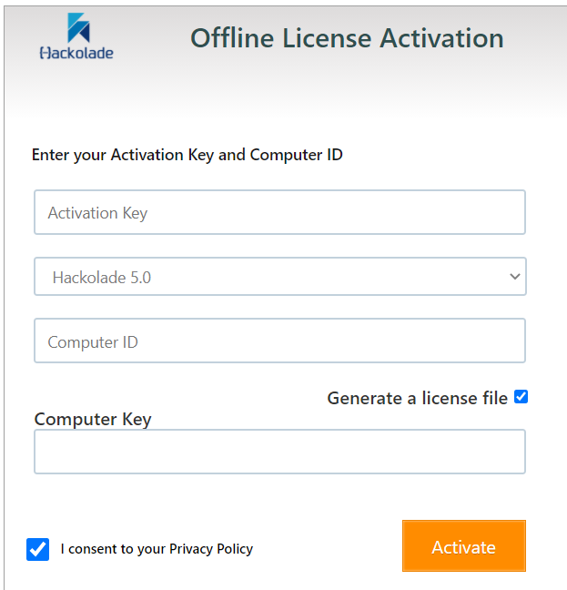

# Running Hackolade Studio CLI in Docker 

The instructions below assume that you have Docker [installed](https://www.docker.com/get-started) and running.

The purpose of running Hackolade Studio in a Docker container is to operate the Command-Line Interface ("CLI"), typically in a the context of integration with CI/CD pipelines.  It is **not** to run the application GUI, a use case which has not been tested.

**Important note:**  the CLI requires a **concurrent** license key with an available seat.  An individual workstation license of Hackolade is **not** sufficient.  To ensure that your CI/CD pipeline jobs always have an available seat, you may want to get a concurrent license key dedicated to this purpose.  On a single machine, you may run multiple containers of the same image in parallel with a concurrent license key.  
To purchase a concurrent license, perpetual or subscription, please send an email to support@hackolade.com. 

To ensure proper behavior of the Hackolade Studio CLI in a Docker container, make sure to run version v5.1.1 or above.


This repository contains files and instructions for running [Hackolade](https://hackolade.com) applications published on [Docker Hub](https://hub.docker.com/r/hackolade/studio):

- [Dockerfile.app](Dockerfile.app): ready-to-use example of a full installation of Hackolade Studio, including the possibility to install selected target plugins
- [Dockerfile.plugins](Dockerfile.plugins): example of a how to install additional target plugins
- [docker-compose.yml](docker-compose.yml): example of how to configure the launch of containers of the Hackolade CLI
- [securityPolicies.json](securityPolicies.json) - the list of required system call operations to be able to run Hackolade inside a container ([more details](https://docs.docker.com/engine/security/seccomp/))
- batch files examples when running on Windows:
  - [docker-help.bat](docker-help.bat): verify the proper running of the CLI by displaying the CLI help in a container.  Will work without a validated license key.
  - [docker-validateKey.bat](docker-validateKey.bat): validate a license key
  - [docker-genDoc.bat](docker-genDoc.bat): run the CLI for the genDoc command.  Requires a validated license key.


## Usage

### Build the image

with a tag “hackolade:latest”:

`docker build --no-cache --pull -f Dockerfile.app -t hackolade:latest .`

The example uses a [Dockerfile.app](Dockerfile.app) which references the latest base [image](https://hub.docker.com/r/hackolade/studio) with all prerequisites needed to run Hackolade.  We chose to not include the Hackolade Studio application in the base image so it would remain stable, while the Dockefile.app instructions download the latest version.  The image has a pre-created user “hackolade” with UID 1000 and GID 1000, which may be needed to synchronize permissions between container and host system.  


#### Plugins

If you need target plugins, they can be installed using one of the following methods:

- by editing the Dockerfile.app file before initial build, so the image immediately includes the selected plugin(s)

- afterwards, by making your selection in the [Dockerfile.plugins](Dockerfile.plugins) file, then running the following command:
  
  `docker build --no-cache -f Dockerfile.plugins -t hackolade:latest .`

If a plugin you need exists but is somehow not listed in your Dockerfile.plugins file, you can find the exhaustive list in the [plugin registry](https://github.com/hackolade/plugins/blob/master/pluginRegistry.json).  Then you may add a line (without the # comment): `RUN installPlugin.sh <plugin name> <plugin version>` You may activate multiple lines to install plugins at the same time. Plugin version is optional parameter, if it is omitted, the latest plugin will be downloaded.


To list existing plugins in your image:

`docker run --rm hackolade:latest ls .hackolade/plugins/`

To view the version number of a plugin in your image:

`docker run --rm hackolade:latest cat .hackolade/plugins/<plugin name>/package.json`


### Run CLI commands in a container

It is suggested to run commands using the [docker-compose.yml](Dockerfile.app) file, possibly after editing it for your specific needs.  The docker-compose file will ensure the presence of 4 required subfolders, and if not, will create them:

         - ./appData:/home/hackolade/.config/Hackolade
         - ./data:/home/hackolade/Documents/data/
         - ./logs:/home/hackolade/Documents/HackoladeLogs/
         - ./options:/home/hackolade/.hackolade/options

The user inside the container must have enough permissions to write and read from these folders.   If you don't use docker-compose, you must create them manually for proper operations.  You may also use absolute path with $PWD.

Description of required subfolders:

- *data*: this folder is used to share files with containers.  It may contain models, documentation, sources for reverse-engineering, artefacts out of forward-engineering, etc...  Instead of a relative path to the location where the container is run, you may reference an absolute path to the location of these files.
- *options*; this folder is used to store custom properties for plugins, naming convention configuration, and Excel export options.  Instead of a relative path to the location where the container is run, you may reference an absolute path to the location of these files.
- *logs* and *appData*: these folders are necessary for the proper operation of the application in containers.


#### Display CLI help in a container

All commands must be executed in the parent folder of the subfolders described above.  It is suggested to run commands using the [docker-compose.yml](docker-compose.yml) file, possibly after editing it for your specific needs. 

A typical command will look like this:

`docker-compose run --rm hackoladeStudioCLI hackolade command [--arguments]`

where:

- `hackoladeStudioCLI` is the name of the service as defined in docker-compose.yml
- `hackolade` invokes the application
- `command` is the CLI command
- `--arguments` is for optional arguments

Example: `docker-compose run --rm hackoladeStudioCLI hackolade help`

You may consult our [online documentation](https://hackolade.com/help/CommandLineInterface.html) for the full description of commands and their respective arguments.


#### Validate license key for the image

##### With Internet connection

All commands must be executed in the parent folder of the subfolders described above.  It is suggested to run commands using the [docker-compose.yml](Dockerfile.app) file, possibly after editing it for your specific needs. 

`docker-compose run --rm hackoladeStudioCLI hackolade validatekey --key=<concurrent-license-key> --identifier=<a-unique-license-user-identifier>`

**Note:** The license key validation must be repeated for each new Docker image.


##### Without Internet connection

If your build server has no Internet connection, it is necessary to do an offline validation of your license key.  The process is as follows:

1. Fetch the UUID of the image: `docker run --rm hackolade:latest show-computer-id.sh`
2. From the browser of a computer with Internet access, go to this page: https://quicklicensemanager.com/hackolade/QlmCustomerSite/

 

  - enter your license key in the "Activation Key" field
  - select the version "Hackolade 5.0" or above
  - enter the UUID fetched above in the "Computer ID" field
  - make sure to check the options "Generate a license file" and "I consent to the Privacy Policy"
  - click the Activate button

  A file LicenseFile.xml will be generated and downloaded by your browser. Do NOT edit or alter the content of the file as it contains integrity validation to prevent abuse.

3. copy the LicenseFile.xml to your build server

4. Validate the license key the command

   `docker-compose run --rm hackoladeStudioCLI hackolade validatekey --key=<concurrent-license-key> --file=LicenseFile.xml`


**Note:** The entire above process must be repeated for each new Docker image as the UUID changes with each creation.


#### Example: generate documentation for a model

All commands must be executed in the parent folder of the subfolders described above.  It is suggested to run commands using the [docker-compose.yml](docker-compose.yml) file, possibly after editing it for your specific needs. 

Assuming that a valid Hackolade model file called *`model.json`* is placed in the *`data`* subfolder of the location where the container is being run:

`docker-compose run --rm hackoladeStudioCLI hackolade genDoc --model=/home/hackolade/Documents/data/model.json --format=html --doc=/home/hackolade/Documents/data/doc.html`

This example can be adjusted to run any CLI command, as documented [here](https://hackolade.com/help/CommandLineInterface.html).


### Custom properties, naming conventions, Excel export options

You may have customized the behavior of the application GUI, and wish to use them during CLI processing.  

If the containers will be running on a machine with no Hackolade Studio GUI, you use in the [docker-compose.yml](docker-compose.yml) file the default subfolder of the location where the containers will be running:

         - ./options:/home/hackolade/.hackolade/options

Or you may reference an absolute path to the location of these files, if you're also running the Hackolade Studio GUI on the same Windows machine:

```Windows
     - C:/Users/%username%/.hackolade/options:/home/hackolade/.hackolade/options
```

