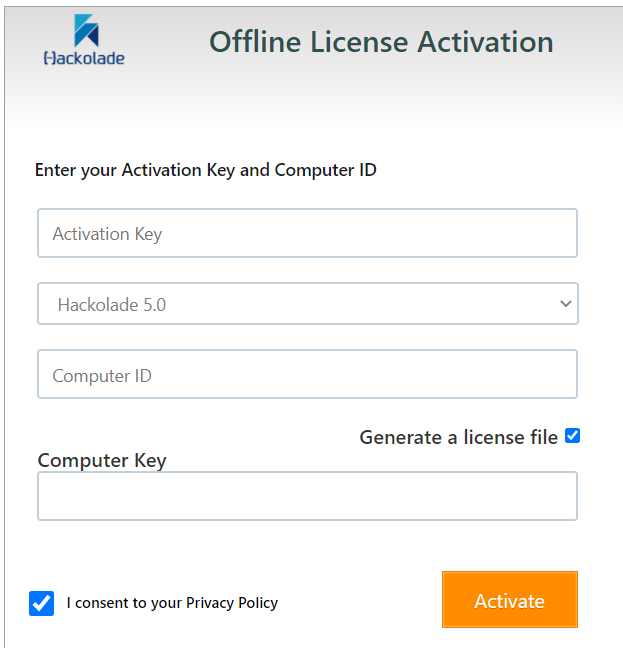

# How to validate a concurrent Hackolade license

Before you can use Hackolade Studio CLI in Docker, you must validate your concurrent license key. This process links your license to the specific Docker image you built.

**Important:** You need a **concurrent license key** (not a workstation license) to use Hackolade in Docker. The license validation must be repeated for each new Docker image you build, as each image has a unique identifier.

---

## Online License Validation (With Internet Connection)

If your server has Internet access, you can validate your license directly.

### Method 1: Using Docker CLI

**Step 1: Get the computer ID (UUID)**
```bash
docker run --rm \
  --entrypoint show-computer-id.sh \
  hackolade:latest
```

This command will output a UUID (like `12345678-1234-1234-1234-123456789abc`). Copy this value - you'll need it in the next step.

**Step 2: Validate the license**
```bash
docker run --rm \
  -v hackolade-studio-app-data:/home/hackolade/.config/Hackolade \
  hackolade:latest validatekey \
  --key=YOUR-LICENSE-KEY \
  --identifier=YOUR-UUID-FROM-STEP-1
```

Replace:
- `YOUR-LICENSE-KEY` with your actual concurrent license key
- `YOUR-UUID-FROM-STEP-1` with the UUID you copied from step 1

**What this does:**
- `docker run --rm` - Runs a container and removes it when done
- `-v hackolade-studio-app-data:...` - Mounts the volume where license data is stored
- `hackolade:latest` - Uses the image you built
- `validatekey` - The Hackolade CLI command to validate a license

### Method 2: Using Docker Compose

**Option A: Two-step process (easier to understand)**
```bash
# Step 1: Get the computer ID
docker compose run --rm --entrypoint show-computer-id.sh hackoladeStudioCLI
```

Copy the UUID that's displayed, then:

```bash
# Step 2: Validate the license
docker compose run --rm hackoladeStudioCLI validatekey \
  --key=YOUR-LICENSE-KEY \
  --identifier=YOUR-UUID-FROM-STEP-1
```

**Option B: One-step process (more advanced)**
```bash
docker compose run --rm hackoladeStudioCLI validatekey \
  --key=YOUR-LICENSE-KEY \
  --identifier=$(docker compose run --rm --entrypoint show-computer-id.sh hackoladeStudioCLI)
```

This single command automatically gets the UUID and validates the license in one go. The `$(...)` part runs the UUID command first and uses its output.

---

## Offline License Validation (Without Internet Connection)

If your server has no Internet connection, you need to validate your license offline using a license file.

### Method 1: Using Docker CLI

**Step 1: Get the computer ID (UUID)**
```bash
docker run --rm \
  --entrypoint show-computer-id.sh \
  hackolade:latest
```

Copy the UUID that's displayed.

**Step 2: Generate the license file**

From a computer with Internet access, open your browser and go to:
[https://quicklicensemanager.com/hackolade/QlmCustomerSite](https://quicklicensemanager.com/hackolade/QlmCustomerSite)



Fill in the form:
- **Activation Key**: Enter your concurrent license key
- **Version**: Select "Hackolade 5.0" or above
- **Computer ID**: Enter the UUID from step 1
- **Options**: Check both "Generate a license file" and "I consent to the Privacy Policy"
- Click the **Activate** button

A file named **LicenseFile.xml** will be downloaded. **Do NOT edit or alter this file** - it contains integrity validation to prevent abuse.

**Step 3: Copy the license file to your server**

Copy the **LicenseFile.xml** file to your server, in the same directory where you run your Docker commands (or wherever you keep your models folder).

**Step 4: Validate the license using the file**

```bash
docker run --rm \
  -v hackolade-studio-app-data:/home/hackolade/.config/Hackolade \
  -v ${PWD}/LicenseFile.xml:/LicenseFile.xml \
  hackolade:latest validatekey \
  --key=YOUR-LICENSE-KEY \
  --file=/LicenseFile.xml
```

Replace `YOUR-LICENSE-KEY` with your actual license key.

**Important:**
- The `--file` argument is a path **inside** the container (`/LicenseFile.xml`)
- The `-v ${PWD}/LicenseFile.xml:/LicenseFile.xml` part mounts your local file into the container
- You must use the **same Docker image** for steps 1 and 4, otherwise the UUIDs won't match

### Method 2: Using Docker Compose

**Step 1: Get the computer ID (UUID)**
```bash
docker compose run --rm --entrypoint show-computer-id.sh hackoladeStudioCLI
```

Copy the UUID that's displayed.

**Step 2: Generate the license file**

Follow the same process as described in "Method 1: Using Docker CLI" step 2 above.

**Step 3: Copy the license file to your server**

Copy the **LicenseFile.xml** file to the same directory where your `docker-compose.yml` file is located.

**Step 4: Validate the license using the file**

```bash
docker compose run --rm \
  -v ${PWD}/LicenseFile.xml:/LicenseFile.xml \
  hackoladeStudioCLI validatekey \
  --key=YOUR-LICENSE-KEY \
  --file=/LicenseFile.xml
```

Replace `YOUR-LICENSE-KEY` with your actual license key.

**Note:** Docker Compose automatically handles the `hackolade-studio-app-data` volume, so you only need to mount the license file.

---

## Troubleshooting

### Error: "Your computer ID does not match the activation key information"

This error means you used different Docker images in steps 1 and 4, resulting in unmatched UUIDs.

**Solution:** Make sure you:
1. Use the same image tag (`hackolade:latest`) for both getting the UUID and validating
2. Don't rebuild the image between steps 1 and 4
3. If you did rebuild, start over from step 1 with the new image

### License validation not persisting

Make sure you're mounting the `hackolade-studio-app-data` volume (or using Docker Compose which does this automatically). The license information is stored in this volume.

### Permission errors

If you get permission errors, ensure the volumes exist:
```bash
docker volume create hackolade-studio-app-data
```

---

## Important Notes

- **Each Docker image has a unique UUID** - you must validate the license for each image you build
- **Use the same image** for getting the UUID and validating the license
- **The license file path** (`--file`) is a path **inside the container**, not on your host
- **Concurrent licenses only** - workstation licenses won't work with Docker
