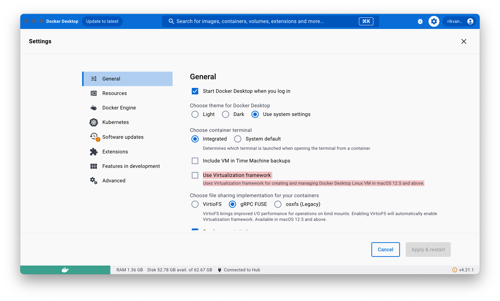
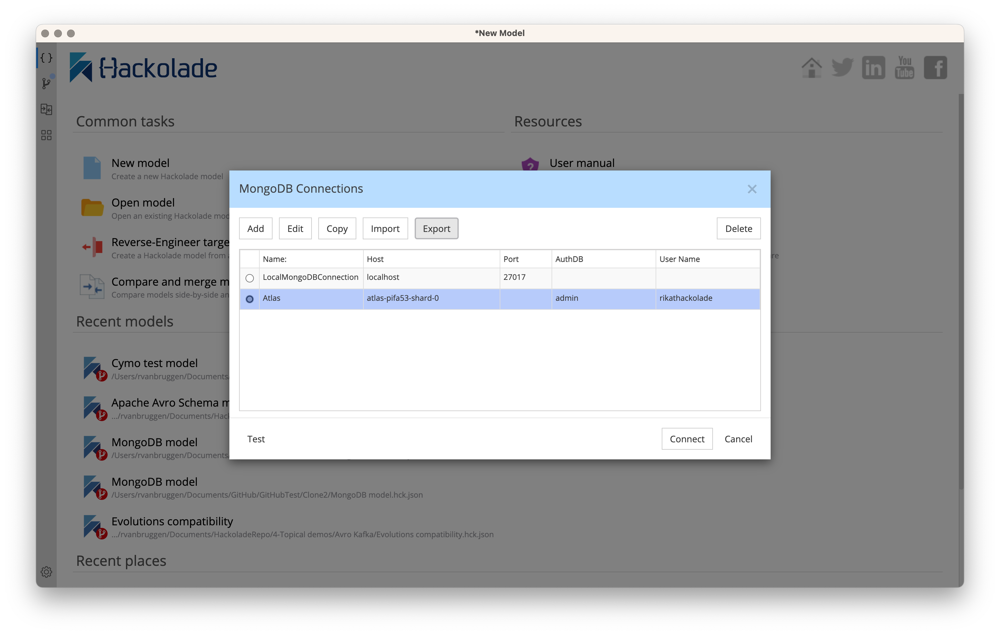
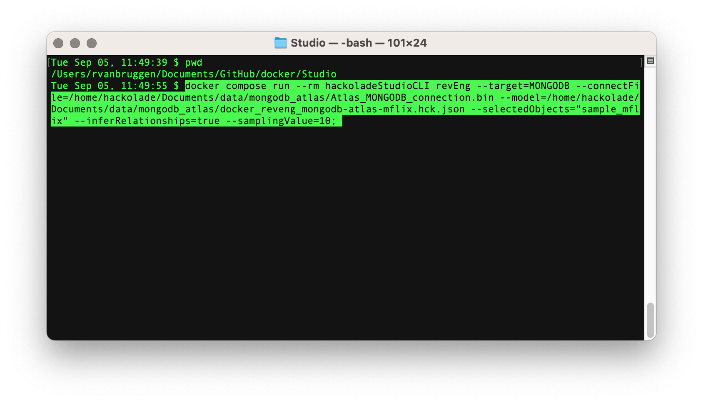
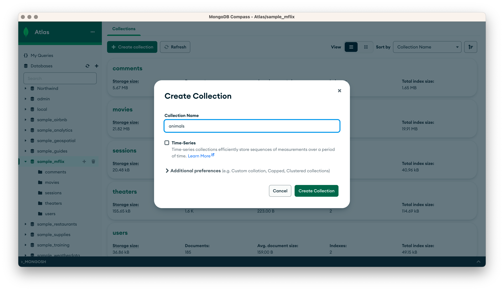
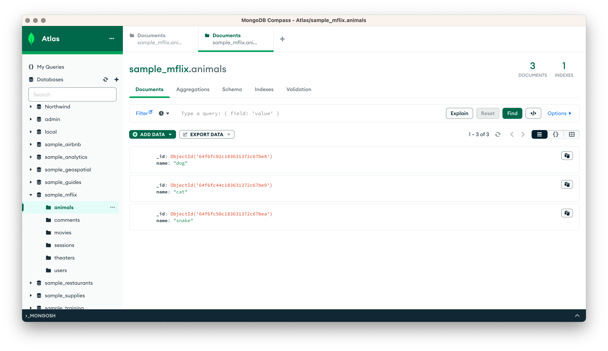
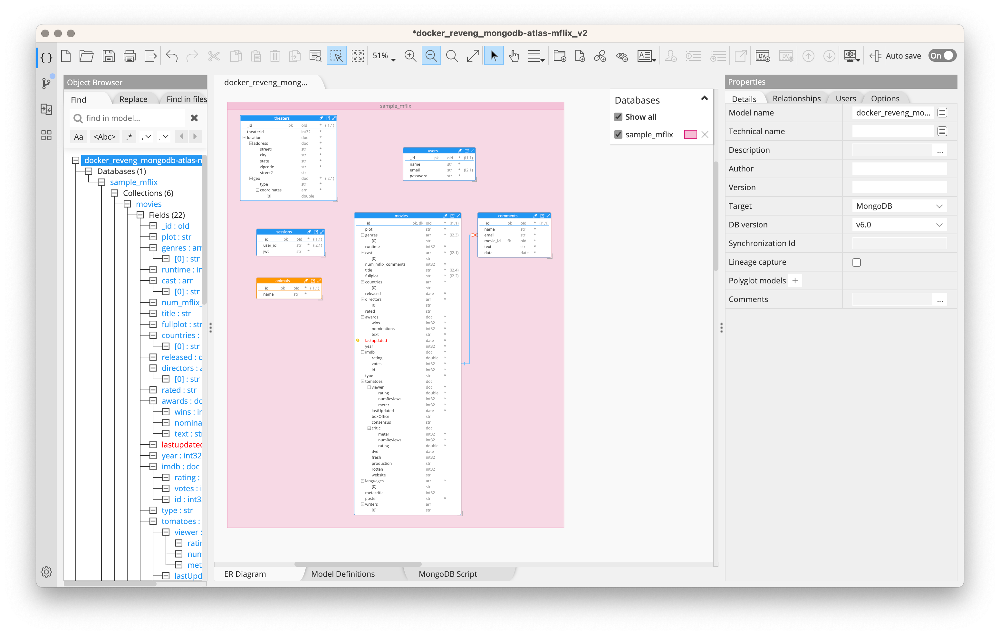
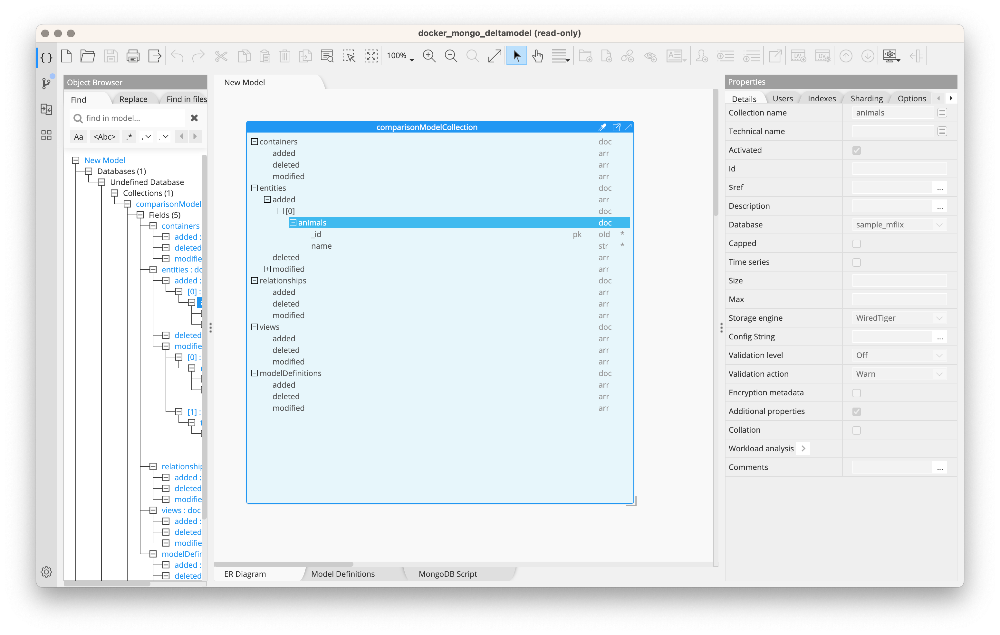
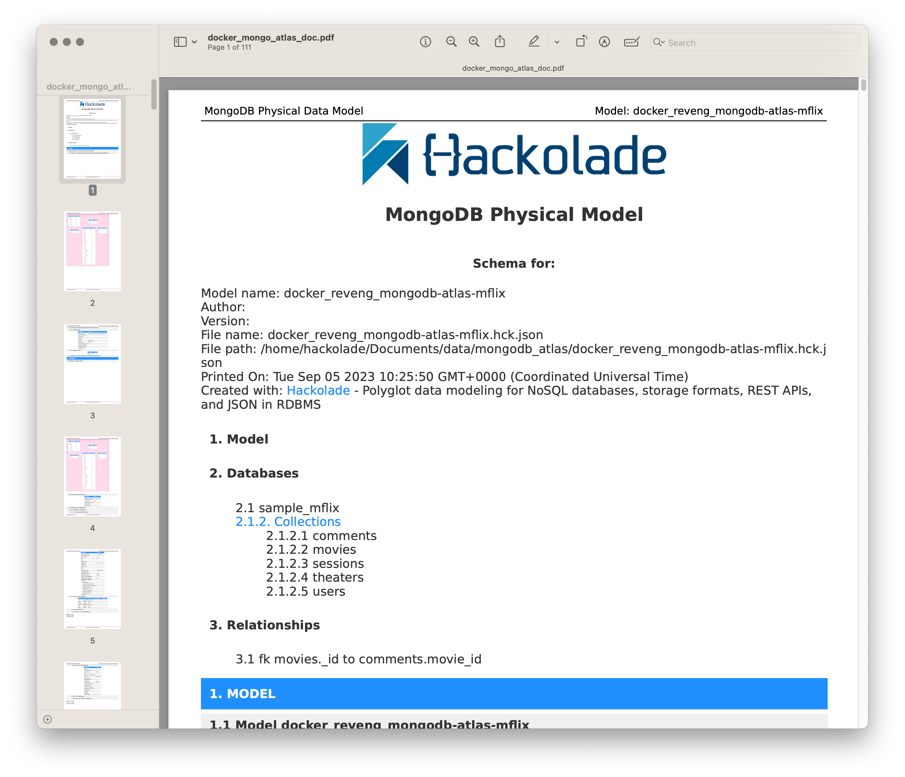
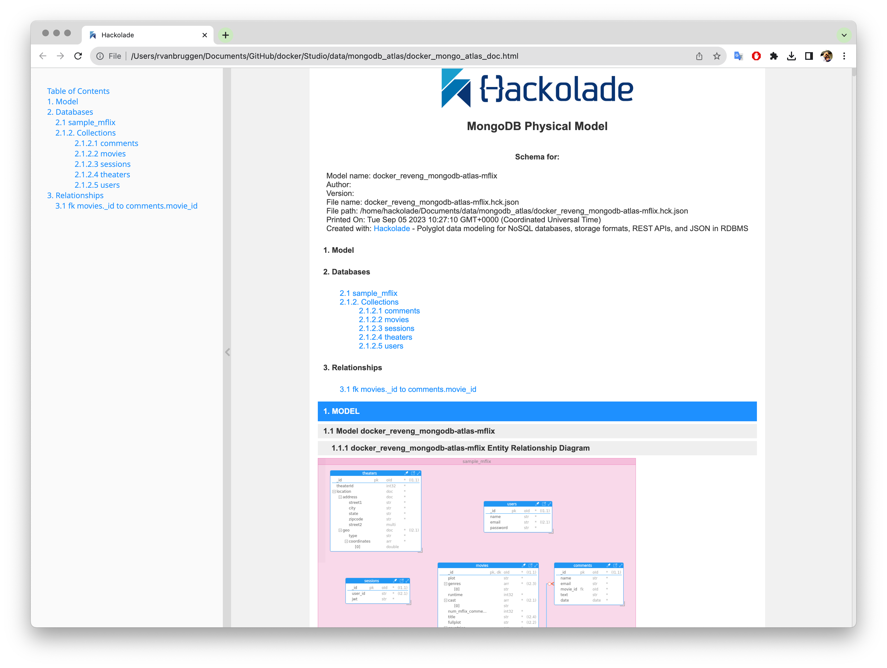

# Running the Hackolade Command-Line Interface in a Docker container

This article is in support of the [video tutorial](https://community.hackolade.com/slides/slide/docker-based-automation-57) on the same subject.


## Context: Metadata-as-Code
One of the big pillars of Hackolade and the Hackolade Studio architecture and functionality, has been the fact that we subscribe to the principles of [Metadata-as-Code](https://hackolade.com/metadata-as-code.html). This is super important to us, as we try to make sure that the walls between different data modeling stakeholders are torn down, and models are forever kept up-to-date. The _infinite loop of DevOps_ is now also a reality in the world of Data Modeling.


As we have discussed elsewhere, (eg. [in this online documentation page](https://hackolade.com/help/Repository.html) and [in this video](https://community.hackolade.com/slides/hackolade-studio-tutorial-5-workgroup-collaboration-and-versioning-5)), Hackolade Studio's JSON-based architecture, and its integration with Git repositories are super important, as they enable new and innovative levels of automation and integration.

## About the Hackolade Command-Line Interface
One of the key components to making this happen, is the Hackolade Studio [Command-Line Interface](https://hackolade.com/help/CommandLineInterface.html). In and of itself, this is super interesting, as it allows for the automation of many functionalities that you would normally performs with the Hackolade Studio graphical user interface, but using a simple to understand script. The easiest way to try this is to call that script from the terminal of your workstation where Hackolade is installed - and get going!

You can find more information about the CLI in our online documentation: 
* [high level information](https://hackolade.com/help/IntegratetheCLIwithDevOpsCICDpip.html)
* [detailed information](https://hackolade.com/help/CommandLineInterface.html)

The interesting thing is that we can not only run this on the workstation where you have Hackolade Studio installed, but you can also install the Hackolade Studio CLI on a server, and trigger it to run **concurrent multi-threaded** sessions in a **Docker container**, as part of that environment.  As part of your CI/CD pipeline, you can trigger data modeling automations and have it perform things like creation of artifacts, forward- and reverse-engineering, model comparisons, documentation generation, ...  All the things that you can use the CLI for, you can now trigger from your pipeline using the Hackolade Studio CLI installed in a Docker container. You can use
* [GitHub Actions](https://docs.github.com/en/actions/creating-actions/creating-a-docker-container-action)
* [Azure Pipelines](https://learn.microsoft.com/en-us/azure/devops/pipelines/)
* [Bitbucket Pipelines](https://support.atlassian.com/bitbucket-cloud/docs/run-docker-commands-in-bitbucket-pipelines/)
* [GitLab CI/CD](https://docs.gitlab.com/runner/executors/docker.html)

to achieve a very similar result. It's super powerful.


In this article, we demonstrate and explain to you how you can use the Hackolade Studio CLI in a Docker container - so that you can achieve the end-2-end automation yourself using the technologies mentioned above.


## About the Hackolade Studio CLI, inside a Docker Container

All the procedures for installing and running the Hackolade Studio CLI inside a Docker container can be found on [the documentation site](https://hackolade.com/help/Dockercontainer.html) of the Hackolade Studio. From there, you will find a link that refers to detailed instructions on [GitHub](https://github.com/hackolade/docker/tree/main/Studio). In this article, I am following these instructions step by step.

The first thing I did was to clone that repo on my local machine in 
`/Users/rvanbruggen/Documents/GitHub/docker/`. 
Once that was done, I would be ready to run all the commands below are run from the following directory: 
`/Users/rvanbruggen/Documents/GitHub/docker/Studio`, as it contains all the configuration files for the docker container to appropriately start.

So let's go through all of the steps one by one:

## 1. Building the image
The first thing we need to do is create the image for us to use it in our Docker installation, which in my case is locally on my Mac:
```
docker build --no-cache --pull -f Dockerfile.app -t hackolade:latest .
```
Once that is done, you also need to make sure that you validate your license key for the image that you are running the Hackolade Studio CLI in.  This is explained in detail on the [GitHub page](https://github.com/hackolade/docker/tree/main/Studio#validate-license-key-for-the-image).


## 2. Installing the plugins based on Dockerfile.plugins file

Next, I edited the `Dockerfile.plugins` file to prepare for the installation of the plugins that I would need later on. Installation is done through this command:

```
docker build --no-cache -f Dockerfile.plugins -t hackolade:latest .
```

_**Note:**  I had to do a little bit of tweaking on my Mac afterwards. When I was running some of the commands below, I was regularly running into "Segmentation faults", which would sometimes (almost 1 in 2 runs) block me from using the software. So I needed a solution, and I found it by doing the following: I had to __disable the "virtualization framework"__ in my Docker installation. Once I did that, the errors were history._



Using the following command, I could check the proper functioning of the CLI installation:
```
docker compose run --rm hackoladeStudioCLI version;
```


## 3. Running some example scenarios

In the next few paragraphs, we will try to explain the ideas around running the Hackolade CLI inside a Docker container with a few specific examples. 
### A. Reverse-Engineering MongoDB Atlas based on connection file
The first thing that we want to explore, is the automatic, docker-based reverse engineering of a data model that is "_in production_" in a particular database instance, in this case a [MongoDB Atlas](https://www.mongodb.com/atlas) database. To do that, I need some kind of a connection to that database, and that means that I would need the credentials. In Hackolade, there is a really nice and easy way to do that: you leverage a "connection file" (see below) that you export from the Hackolade Studio user interface:

This connection file is created and exported from Hackolade Studio UI: `Atlas_MONGODB_connection.bin`, and is then placed in the local Docker data structure that you can find in the `./data/` directory of this repo. So let's do a first run and give it a try.

#### First run: reverse-engineering to a file
From the `/Users/rvanbruggen/Documents/GitHub/docker/Studio` directory, we are going to run the following command
```
docker compose run --rm hackoladeStudioCLI revEng --target=MONGODB --connectFile=/home/hackolade/Documents/data/mongodb_atlas/Atlas_MONGODB_connection.bin --model=/home/hackolade/Documents/data/mongodb_atlas/docker_reveng_mongodb-atlas-mflix.hck.json --selectedObjects="sample_mflix" --inferRelationships=true --samplingValue=10;
```
This command will run, as if it was actually running in our local CLI - but it is actually running inside the docker container. 


After a few seconds, the model will have been created in the location specified above, and we can open the file using the Hackolade Studio:


This seems to have worked really well. Remember that this is a completely automatable step - one that we could for example trigger from a pipeline or a GitHub Action or something similar.
#### Intermediate step: using Compass
Using MongoDB Compass, we can make a change to the `sample_mflix` database and add a collection that has one or two attributes. In this case I am adding the `animals` collection:

and adding a few sample documents to it in Compass:

So now we have actually made some structural and specific changes to the database, that are no longer in sync with the model that we had generated through reverse engineering above. Time for another run!


#### Second run: reverse-engineering the modified MongoDB Atlas database
In the second run, we execute exactly the same command, but we create a separate and second model from the reverse engineering:
```
docker compose run --rm hackoladeStudioCLI revEng --target=MONGODB --connectFile=/home/hackolade/Documents/data/mongodb_atlas/Atlas_MONGODB_connection.bin --model=/home/hackolade/Documents/data/mongodb_atlas/docker_reveng_mongodb-atlas-mflix_v2.hck.json --selectedObjects="sample_mflix" --inferRelationships=true --samplingValue=10;
```
As you can see, we have reverse-engineered a new version of the model:


Again: all of this has been automated and can be scheduled through the use of pipelines. 


### B. Compare the two reverse-engineered models
We now have two versions of the reverse-engineered models of the MongoDB database. The logical next step would then be that we  use the docker-based CLI to check if anything has changed between these two version (eg. someone has made a change in the production database without updating the data model - a very _hypothetical_ example!) by creating a **delta model** that formalizes the difference between the two versions of the model. Here's how we do that:

```
docker compose run --rm hackoladeStudioCLI compMod --model1=/home/hackolade/Documents/data/mongodb_atlas/docker_reveng_mongodb-atlas-mflix.hck.json --model2=/home/hackolade/Documents/data/mongodb_atlas/docker_reveng_mongodb-atlas-mflix_v2.hck.json --deltamodel=/home/hackolade/Documents/data/mongodb_atlas/docker_mongo_deltamodel.hck.json;
```


As you can see below, the delta model has indeed detected the change between models, accurately:


The idea here, would of course be that - if such an inadvertent or potentially malicious change would be detected between different versions of the data model, there would again be some automatic triggers that would happen and that would for example notify the appropriate governance organization, etc.


### C. Generate documentation in pdf and html format
We can use the docker-based CLI to automatically generate documentation for our models. We can also use this as part of a pipeline: every time a pipeline detects that a new version of a data model has been committed to the Git repository, it can trigger a documentation generation activity in a docker script. Hackolade Studio supports documentation generation in html, pdf and markdown format - each with their own specific use cases. Let's explore these.
#### i. PDF documentation for the Atlas MongoDB Mflix model
Using the following command, we will generate a PDF documentation for the MongoDB model that we had reverse-engineered above.

```
docker compose run --rm hackoladeStudioCLI genDoc --model=/home/hackolade/Documents/data/mongodb_atlas/docker_reveng_mongodb-atlas-mflix.hck.json --format=pdf --doc=/home/hackolade/Documents/data/mongodb_atlas/docker_mongo_atlas_doc.pdf;
```
This then creates the following PDF file:

Let's now explore the documentation generation into an HTML page.
#### ii. HTML documentation for the Atlas MongoDB Mflix model
Using the following command, we will generate an HTML page for the MongoDB model that we had reverse-engineered above. Note that the HTML page is of a specific format, that includes all the required images packaged into the HTML file - there are no separate image files needed to publish this page on an intranet, website, sharepoint server. 
```
docker compose run --rm hackoladeStudioCLI genDoc --model=/home/hackolade/Documents/data/mongodb_atlas/docker_reveng_mongodb-atlas-mflix.hck.json --format=html --doc=/home/hackolade/Documents/data/mongodb_atlas/docker_mongo_atlas_doc.html;
```


This wraps up our examples of documentation generation with the Docker based command-line-interface of Hackolade.


## 4. Conclusion and wrap-up
With the above examples, we have tried to show you how you can run different scenario commands from the Hackolade Studio Command-Line Interface installed in a Docker container. As we mentioned at the start, the great value of this system lies in the fact that this can be tied into an entire DevOps pipeline using workflow automation like for example 

* [GitHub Actions](https://docs.github.com/en/actions/creating-actions/creating-a-docker-container-action)
* [Azure Pipelines](https://learn.microsoft.com/en-us/azure/devops/pipelines/)
* [Bitbucket Pipelines](https://support.atlassian.com/bitbucket-cloud/docs/run-docker-commands-in-bitbucket-pipelines/)
* [GitLab CI/CD](https://docs.gitlab.com/runner/executors/docker.html)

Again: this allows for automated and increased governance processes on top of our data models and schemas, which will help our overall mission of reconciling business and IT through a shared understanding of the meaning and context of data.

Thank you for your attention - we hope that this was useful.